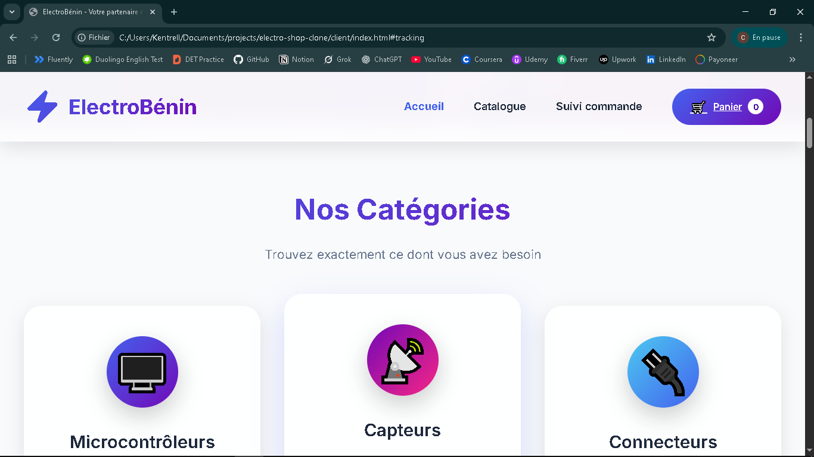
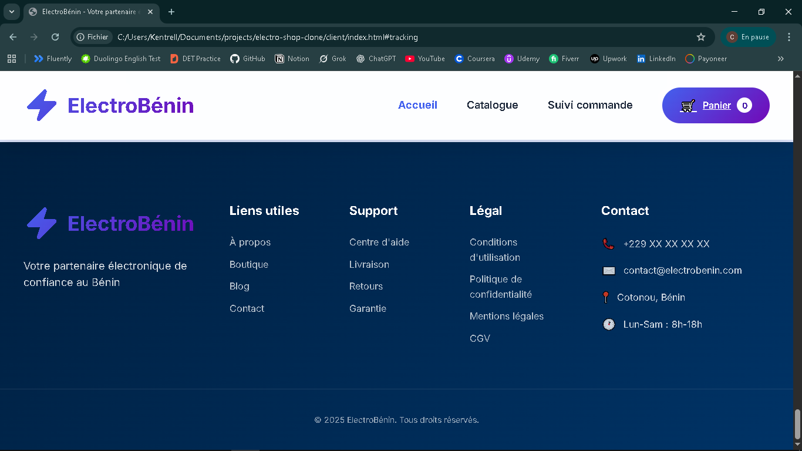
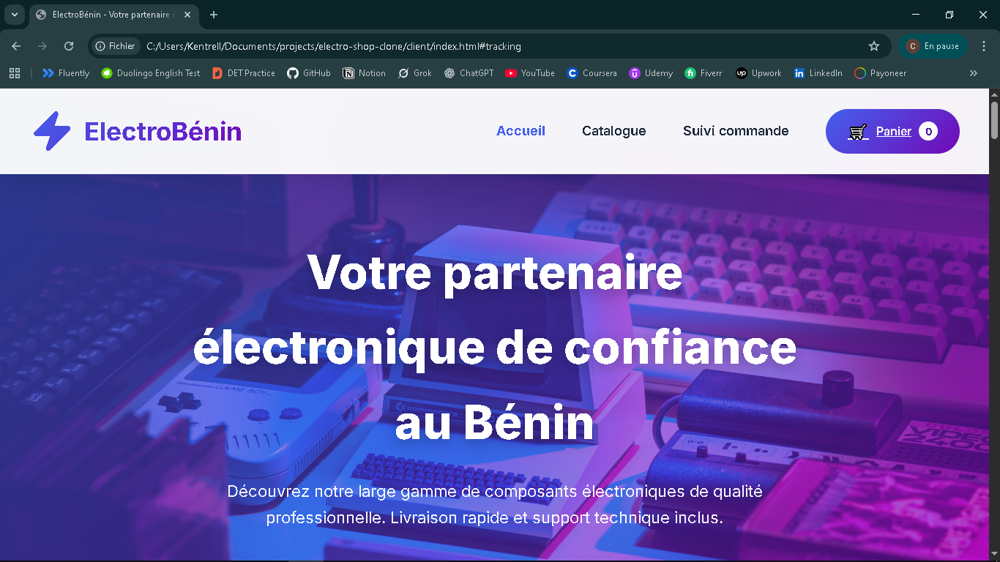
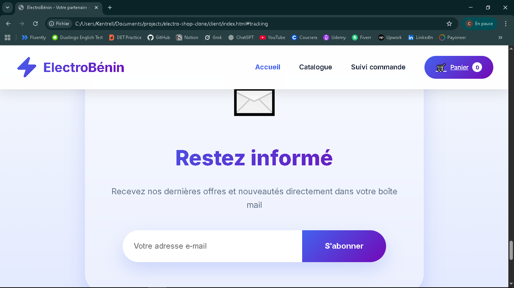
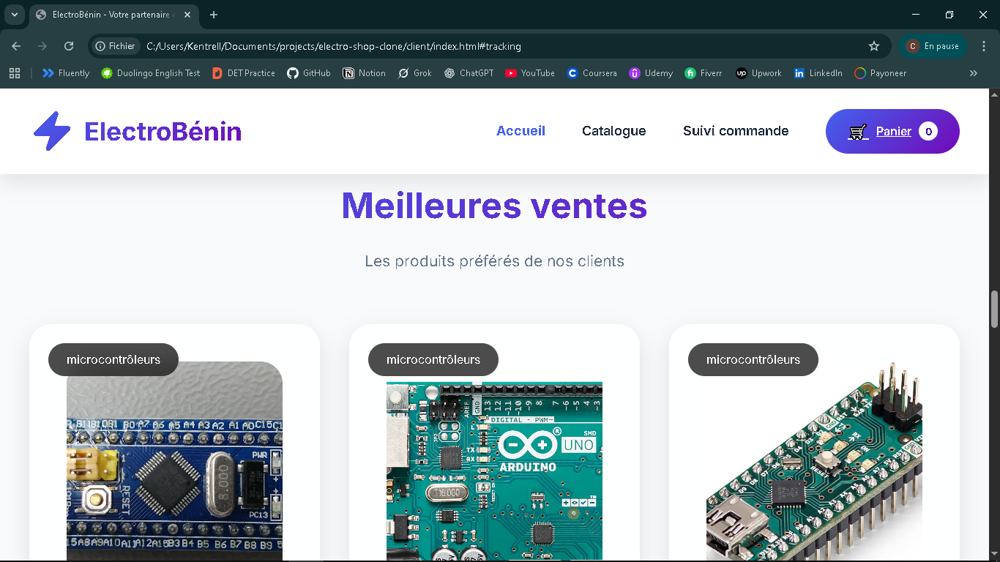

# 🛍️ Electro Shop Clone

<div align="center">


**Un clone de site e-commerce élégant pour maîtriser le développement web moderne**

[](https://cejunior-web.github.io/electro-shop-clone/)
[](https://github.com/cejunior-web/electro-shop-clone)

</div>

---

## ✨ Aperçu du Projet

<div align="center">

### 🎨 Galerie d'Interfaces

| | | |
|:---:|:---:|:---:|
| **Navigation**<br> | **Structure**<br> | **Identité**<br> |
| **Communication**<br> | **Produits**<br> | **Confiance**<br> |
| **Valeur**<br> | | |

</div>

---

## 📖 À Propos

> Un projet pédagogique raffiné conçu pour transcender les bases du développement web et aborder des concepts full-stack avancés.

**Electro Shop Clone** n'est pas simplement un exercice de style, c'est une immersion dans les meilleures pratiques du développement web moderne, alliant design élégant et code robuste.

---

## 🚀 Caractéristiques Techniques

### 🎯 **Fonctionnalités Principales**
- ✅ **Design Responsive** - Adapté à tous les appareils
- ✅ **Navigation Avancée** - Parcours utilisateur intuitif
- ✅ **Catalogue Dynamique** - Affichage et filtrage des produits
- ✅ **UX/UI Optimisée** - Expérience utilisateur fluide
- ✅ **Performance** - Chargement optimisé

### 🔧 **Stack Technologique**
```yaml
Frontend:
  - HTML5: Structure sémantique moderne
  - CSS3: Animations et design responsive
  - JavaScript: Interactivité avancée

Outils:
  - Git: Versioning professionnel
  - GitHub: Collaboration et déploiement
  - Markdown: Documentation élégante

  electro-shop-clone/
├── 📄 index.html          # Point d'entrée principal
├── 🎨 style.css           # Design system complet
├── ⚡ script.js           # Logique interactive
├── 📖 README.md           # Documentation
└── 📸 screenshots/        # Références visuelles
    ├── 🏷️  category.png
    ├── 👣  footer.png
    ├── 🎯  header.png
    ├── 📧  newsletters.png
    ├── 📦  products.png
    ├── ⭐  testimonials.png
    └── ✅  why_us.png


🛠️ Installation & Démarrage

### Prérequis
- Navigateur web moderne (Chrome, Firefox, Edge)
- Éditeur de code (VS Code recommandé)
- Git (pour cloner le projet)

### Étapes d'installation

# 1. Cloner le dépôt
git clone https://github.com/cejunior-web/electro-shop-clone.git

# 2. Naviguer dans le dossier
cd electro-shop-clone

# 3. Ouvrir dans votre éditeur
code .  # Ou votre éditeur préféré

# 4. Lancer en local
# Double-cliquez simplement sur index.html


## 🎯 **Version simplifiée si tu préfères :**

```markdown
## 🚀 Installation Rapide

```bash
# Cloner et lancer
git clone https://github.com/cejunior-web/electro-shop-clone
cd electro-shop-clone
start index.html  # Sur Windows

## 🤔 **Si ton projet n'a pas besoin d'installation :**

Même pour un projet simple HTML/CSS, garde au minimum :

```markdown
## 📂 Utilisation

1. Téléchargez ou clonez le projet
2. Ouvrez `index.html` dans votre navigateur
3. Explorez les différentes sections

🎯 **Accès direct :** [Ouvrir la démo](https://cejunior-web.github.io/electro-shop-clone/)

## 👨‍💻 Auteur

<div align="center">

### **Cejunior OKE**
*HumanKind Lover | Développeur Full-Stack en devenir*

[](https://github.com/cejunior-web)
[](https://github.com/cejunior-web)
[](https://www.linkedin.com/in/cejunior-oke-726965376)

</div>

---

<div align="center">

### ⭐ **Si ce projet vous plaît, n'hésitez pas à lui donner une étoile !**

*« Le code est comme la poésie – il doit être beau à lire et efficace à exécuter. »*

</div>